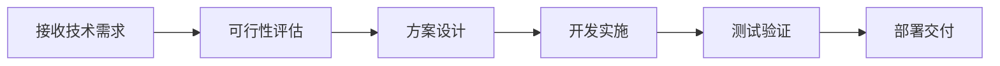

# ⚙️ 技术部 · Technology Department

**部长：吴景辉** | 下属：4人（何俊杰、宋欣然、叶诗涵、周泽宇）

## 部门定位
公司的技术基础设施支撑部门，负责工具开发、系统集成、爬虫数据管道、自动化流程建设及系统运维。

## 工作流程

## 本仓库用途
- 🛠 内部工具开发与脚本管理
- 🕷 数据爬虫与API对接代码
- 🤖 自动化工作流脚本
- 🔧 系统配置与运维文档

## 分派任务流程
1. 各部门在 Issues 中提交技术需求
2. 吴景辉部长评估排期并分配
3. 开发人员提交 PR 附代码+测试
4. 部长代码审查 → 合并 → 部署
